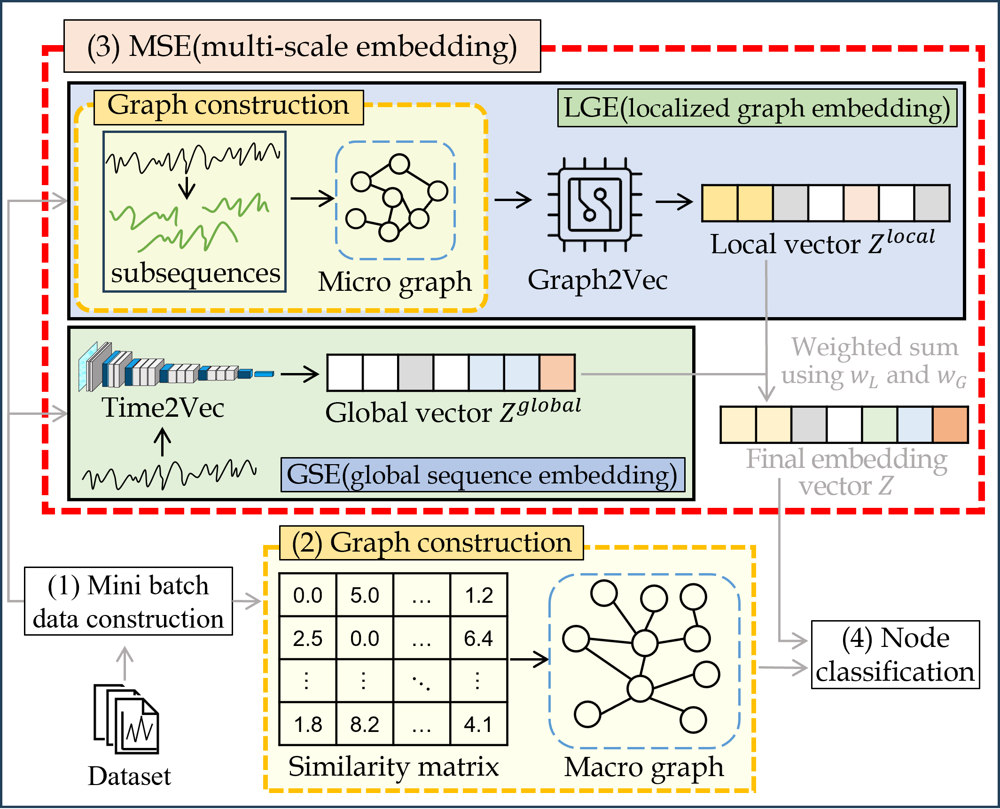

# T2G
We propose Time2Graph, a novel graph-based model for time series classification(TSC). Time2Graph maximizes both embedding fidelity and classification performance by constructing a nested graph composed of a macro graph, which captures the global relationships among time series, and micro graphs, each of which reflects the local characteristics within each individual time series.



## License

This project is licensed under the MIT License.  
It also includes code from Daochen Zha's implementation (MIT License, 2022).  
See the LICENSE file for details.

## Installation
Please use both Python 3.6. and Python 3.8
```
pip3 install -r requirements.txt
```

## Datasets
We provide an example dataset **Coffee** in this repository. You may download the full UCR datasets [here](https://www.cs.ucr.edu/~eamonn/time_series_data_2018/).

## Quick Start
We use **Coffee** as an example to demonstrate how to run the code. You may easily try other datasets with arguments `--dataset`. We will show how to get the results for SimTSC and T2G.

First, prepare the dataset with (the generated dataset is already available in this repository)
```
python3.6 create_dataset.py
```

Second, install the python wrapper of UCR DTW library (the DTW library is already available in this repository)
```
git clone https://github.com/daochenzha/pydtw.git
cd pydtw
pip3 install -e .
cd ..
```

Third, compute the dtw matrix for **Coffee** (the dtw matrix is already available in this repository)
```
python3.6 create_dtw.py
```

Fourth, compute the dtw matrix for subsequences of **Coffee** (the subsequence dtw matrix is already available in this repository)
```
python3.6 get_subsequence_dtw.py
```

1. For SimTSC:
```
python3.8 train_simtsc.py
```

2. For T2G:
```
python3.8 train_simtsc.py

All the logs will be saved in `logs/`
```

## Descriptions of the Files

1. `create_dataset.py` is a script to pre-process dataset and save them into npy. Some important hyperparameters are as follows.
*   `--dataset`: what dataset to process
*   `--shot`: how many training labels are given in each class

2. `create_dtw.py` is a script to calculate pair-wise DTW distances of a dataset and save them into npy. Some important hyperparameters are as follows.
*   `--dataset`: what dataset to process

3. `get_subsequence_dtw.py` is a script to calculate pair-wise DTW distances for subsequence of a dataset and save them into npy. Some important hyperparameters are as follows.
*   `--dataset`: what dataset to process
*   `--w`: window size
*   `--j`: shift size of j-window
*   `--d`: factor used to calculate stride (j) from w
*   `--f`: window size selection function

4. `train_simtsc.py` is a script to do classification of a dataset with SimTSC. Some important hyperparameters are as follows.
*   `--dataset`: what dataset we operate on
*   `--shot`: how many training labels are given in each class
*   `--gpu`: which GPU to use
*   `--K`: number of neighbors per node in the constructed graph
*   `--alpha`: the scaling factor of the weights of the constructed graph
*   `--batch`: mini-batch size
*   `--epoch`: # of epochs

5. `time2graph.py` is a script to do classification of a dataset with T2G. Some important hyperparameters are as follows.
*   `--dataset`: what dataset we operate on
*   `--shot`: how many training labels are given in each class
*   `--gpu`: which GPU to use
*   `--K`: number of neighbors per node in the constructed graph
*   `--alpha`: the scaling factor of the weights of the constructed graph
*   `--batch`: mini-batch size
*   `--epoch`: # of epochs
*   `--res`: weight of GSE
*   `--sub`: weight of LGE
*   `--d`: factor used to calculate stride (j) from w
*   `--f`: window size selection function

